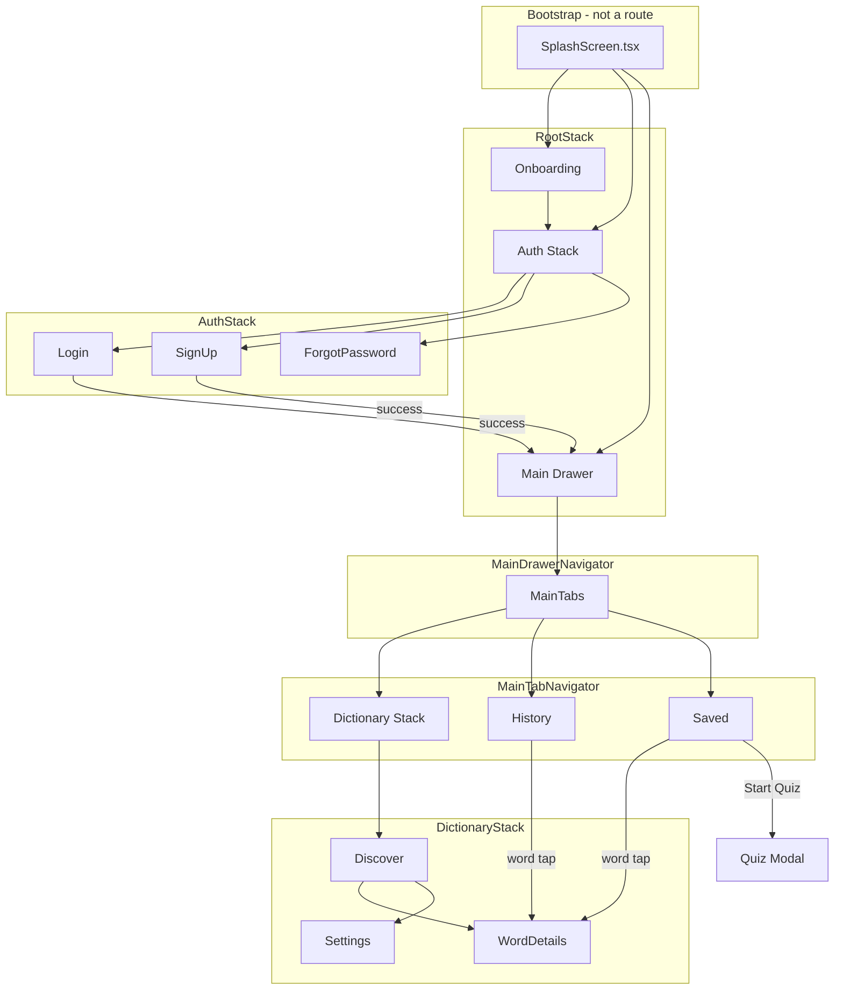
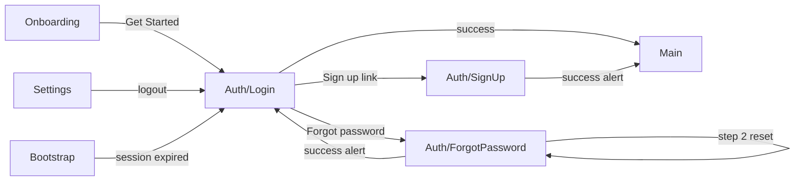
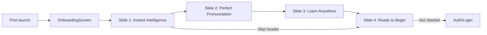

# Navigation Audit

Comparison of the current React Native navigation (`src/navigation/AppNavigator.tsx`, `DrawerContent.tsx`, `navigationHelpers.ts`) against Stitch designs in `stitch_verba_intelligence_platform/`. Based on traced routes and reachability — not naming assumptions.

---

## 1. Current navigation structure

**Registered param lists** (`AppNavigator.tsx`):

| Navigator | Screens |
|---|---|
| `RootStack` | `Onboarding`, `Auth`, `Main` |
| `AuthStack` | `Login`, `SignUp`, `ForgotPassword` |
| `MainDrawer` | `MainTabs` (single child) |
| `MainTab` | `Dictionary`, `History`, `Saved` |
| `DictionaryStack` | `Discover`, `WordDetails`, `Settings` |

**Bootstrap logic** (`AppNavigator.tsx` lines 208–233):

1. While `authLoading` or `bootstrapRoute === null` → render `SplashScreen` (not in navigator).
2. If `verba_first_launch_done` ≠ `'true'` → `Onboarding`.
3. Else if authenticated → `Main`.
4. Else → `Auth` (defaults to `Login`).

---

## 2. Drawer flow

**Implementation:** `MainDrawerNavigator` wraps `MainTabNavigator`. Custom `DrawerContent.tsx`.

| Action | Behavior |
|---|---|
| Open drawer | Swipe from left edge (`swipeEdgeWidth: 56`) on any Main tab; **or** hamburger on `Discover` header only |
| Close drawer | Tap outside, navigate item, or programmatic `DrawerActions.closeDrawer()` |
| Home | `MainTabs` → `Dictionary` → `Discover` |
| Search History | `MainTabs` → `History` |
| Saved Words | `MainTabs` → `Saved` |
| Settings | `MainTabs` → `Dictionary` → `Settings` |
| Recent lookup (≤8) | `navigateToWordDetails` → `Dictionary/WordDetails` |

**Stitch reference:** `navigation_main_drawer` + drawer section in `verba_home_search_insights`.

| Stitch drawer item | RN status |
|---|---|
| Profile header (name, tier, words mastered) | Partial — name/email from auth; no tier/level badge |
| Search History | ✓ Tab + drawer link |
| Saved Words | ✓ Tab + drawer link |
| Word of the Day | Missing — WOD only on Discover, no drawer destination |
| Settings | ✓ |
| About | Missing |
| Feedback | Missing |
| Support / Help | Missing |
| Verba Premium upgrade card | Missing (Premium label exists in Settings account badge only) |
| Recent searches in drawer | ✓ RN addition (8 items) — not in standalone drawer Stitch HTML |

**Stitch home desktop drawer** (`verba_home_search_insights`) also lists **Learning Path** and **Help** — neither exists in RN drawer.

---

## 3. Bottom tab flow

**RN tabs** (`VerbaTabBar.tsx`): Dictionary · History · Saved

| Tab | Screen | Header |
|---|---|---|
| Dictionary | `DictionaryStackNavigator` (default: Discover) | Discover: shown (“Verba” + menu + account); WordDetails: hidden; Settings: shown |
| History | `HistoryScreen` | Shown (“Search History”) |
| Saved | `SavedWordsScreen` | Shown (“Saved Words”) |

**Stitch mobile bottom nav** (`verba_home_search_insights`): Dictionary · **Translate** · History · **Profile**

| Stitch tab | RN equivalent |
|---|---|
| Dictionary | ✓ `Dictionary` tab → Discover |
| Translate | **Not implemented** — no tab, stack, or route |
| History | ✓ `History` tab |
| Profile | **Diverged** — no Profile tab; account/settings via Discover header icon + drawer Settings |
| Saved | **RN addition** — dedicated Saved tab (Stitch mobile bottom bar has no Saved; saved access via drawer/desktop nav) |

Tab presses use standard React Navigation `tabPress` with focus check; no custom deep-link params on tab switch.

---

## 4. Auth flow

| Stitch screen | RN path | Notes |
|---|---|---|
| `authentication_login` | `Auth/Login` | ✓ Reachable |
| `authentication_signup` | `Auth/SignUp` | ✓ Reachable |
| `authentication_forgot_password_entry` | `Auth/ForgotPassword` step `request` | ✓ Merged screen |
| `authentication_reset_password` | `Auth/ForgotPassword` step `reset` | ✓ Same screen |
| `authentication_otp_verification` | — | No route |
| `authentication_success_state` | — | Alert only; immediate `Main` reset |
| `authentication_recovery_success` | — | Alert → `Login` |
| `authentication_session_expired` | — | `lastMessage` alert on `Login` |
| `authentication_error_state` | — | Generic error alert; no lockout UI |

**Auth gate:** Stitch home mock shows main app without an explicit login wall. RN **requires authentication** before `Main` (post-onboarding). Returning users with valid session bootstrap directly to `Main`.

**Helpers:** `resetToAuth`, `resetToOnboarding` in `navigationHelpers.ts` for logout and onboarding reset (onboarding reset not wired from Settings in current code).

---

## 5. Onboarding flow

| Detail | RN | Stitch |
|---|---|---|
| Slide count | 4 individual slides | `onboarding_flow` composites 3; plus separate `onboarding_*` folders |
| Skip | Header skip on slide 1 only | Stitch varies per slide |
| Completion destination | `Auth/Login` (not `Main`) | Stitch exploration mock goes to home without auth |
| Persistence | `AsyncStorage` key `verba_first_launch_done` | — |
| Reachability after completion | Only via clearing storage / `resetToOnboarding` | — |

Individual Stitch onboarding folders (`onboarding_search`, `onboarding_audio`, `onboarding_offline`, `onboarding_final`) map to RN slide components. `onboarding_flow` composite is unused.

---

## 6. Dead-end screens

A dead-end screen has no clear forward navigation without back, alert dismiss, or system action.

| Screen / UI | Dead-end? | Exit path |
|---|---|---|
| `Onboarding` final slide | No | Get Started → Auth |
| `Auth/Login` | No | Sign up, forgot password, success → Main |
| `Auth/SignUp` | No | Back, success → Main |
| `Auth/ForgotPassword` | No | Back → Login; success alert → Login |
| `Discover` | No | Search → WordDetails; drawer; tabs; Settings |
| `WordDetails` (success) | No | Back gesture/button; related words; save |
| `WordDetails` (`ErrorView`) | No | Retry, back, search new word; offline → Saved tab |
| `History` | No | Word tap → WordDetails; tabs; drawer swipe |
| `Saved` | No | Word tap → WordDetails; quiz modal; tabs; drawer |
| `Settings` | No | Back; logout → Auth |
| Quiz `Modal` | No | Close button; finish alert dismisses |
| `SplashScreen` | Transient | Resolves to Onboarding, Auth, or Main |

**No registered RN routes are true dead-ends** — all stack screens expose back navigation or tab switching.

---

## 7. Unreachable screens

### Stitch designs with no RN route (cannot be navigated to)

| Stitch folder | Reason |
|---|---|
| `app_store_showcase` | Marketing only |
| `audio_experience_eloquent` | No route; audio inline on WordDetails |
| `authentication_otp_verification` | Not in AuthStack |
| `authentication_error_state` | No lockout screen |
| `authentication_success_state` | Replaced by alerts + navigation |
| `authentication_recovery_success` | Alert only |
| `authentication_session_expired` | Alert on Login only |
| `onboarding_flow` | Composite unused |
| `search_loading_empty_states` | Gallery; loading/errors on WordDetails |
| `system_states` | Error gallery |
| `state_update_required` | No force-update flow |
| `shader_1`, `shader_2` | Decorative |
| `verba_app_logo` | Asset reference |
| `verba_intelligence` | Design tokens only |

### RN UI that is reachable but not a named route

| UI | Access |
|---|---|
| `SplashScreen` | Bootstrap only |
| `SearchSuggestionsPanel` | Overlay on Discover when typing |
| Quiz modal | Saved → Start Quiz |
| `ErrorView` variants | WordDetails fetch failure only |
| `LoadingSpinner` on WordDetails | After search navigation |

### RN routes with limited discoverability

| Route | Limitation |
|---|---|
| `Settings` | No bottom-tab entry; only Discover header account icon or drawer |
| Drawer (hamburger) | Button only on Discover — History/Saved rely on swipe |
| `ForgotPassword` reset step | No deep link; must complete step 1 in same session |

---

## 8. Missing navigation paths

Paths present in Stitch designs but absent or incomplete in RN:

| Missing path | Stitch source | Impact |
|---|---|---|
| Translate feature / tab | `verba_home_search_insights` bottom nav | No translation screen or tab |
| Profile tab | `verba_home_search_insights` bottom nav | Account spread across Settings + drawer profile |
| Learning Path | `verba_home_search_insights` desktop drawer | No route |
| Drawer → Word of the Day | `navigation_main_drawer` | WOD only visible on Discover scroll |
| Drawer → About / Feedback / Support | `navigation_main_drawer` | No routes or external links from drawer |
| Drawer → Premium upgrade | `navigation_main_drawer` | No paywall / upgrade flow |
| Auth OTP verification | `authentication_otp_verification` | Password reset skips OTP |
| Dedicated auth success / recovery / session-expired screens | Multiple `authentication_*` folders | Reduced visual continuity |
| Force app update | `state_update_required` | No version gate on launch |
| Global offline gate | `state_offline` | Offline only surfaces on WordDetails fetch |
| Immersive pronunciation screen | `audio_experience_eloquent` | No expand/full-screen audio route from WordDetails |
| Inline search loading on home | `search_loading_empty_states` | Search jumps to WordDetails before loading UI on home |
| Onboarding → Main (skip auth) | Stitch home mock | RN always sends new users to Login |
| Saved → new custom collection | `saved_words_collections` | Fixed collection enums only |

---

## 9. Navigation improvements over Stitch designs

| Improvement | Detail |
|---|---|
| **Auth-gated main app** | Clear session model (`AuthContext`); bootstrap chooses Auth vs Main; logout returns to Login |
| **Dedicated Saved tab** | Saved Words in bottom nav — faster access than Stitch mobile bar (which omitted Saved) |
| **History as first-class tab** | Full `HistoryScreen` tab plus drawer duplicate + recent lookups in drawer |
| **Nested word navigation helper** | `navigateToWordDetails` walks parent navigators — works from History, Saved, drawer without manual stack juggling |
| **Drawer + tabs hybrid** | Combines Stitch drawer links with persistent bottom tabs for core loops |
| **Settings in Dictionary stack** | Preserves tab context when opening settings from Discover |
| **Quiz without new route** | Vocabulary quiz as modal on Saved — keeps tab bar visible context |
| **Forgot-password merge** | Single `ForgotPassword` screen with steps — fewer stack pushes than separate Stitch screens |
| **Error recovery actions** | `ErrorView` offline path to Saved tab; 404 inline re-search — actionable without leaving app shell |

---

## 10. Navigation regressions compared to Stitch designs

| Regression | Stitch expectation | RN current behavior |
|---|---|---|
| **No Translate tab** | Fourth bottom-tab pillar | Feature and route absent |
| **No Profile tab** | Profile tab for account hub | Split across Settings stack screen and drawer header |
| **Hamburger inconsistency** | Menu affordance on home | `openAppDrawer` button only on Discover; History/Saved headers have no menu icon (swipe only) |
| **Drawer menu trimmed** | WOTD, About, Feedback, Support, Premium | Only Home, History, Saved, Settings + recent searches |
| **No Learning Path** | Desktop drawer in home mock | Not implemented |
| **Auth wall after onboarding** | Home reachable in mocks | Onboarding always → Login before Main |
| **No OTP in recovery** | Email → OTP → reset | Email → alert → inline reset step |
| **No dedicated auth state screens** | Full-screen success, locked, session expired | System alerts only |
| **No immersive audio route** | Dedicated pronunciation experience | Inline player on Word Details |
| **No force-update path** | Blocking update screen | App always proceeds if session valid |
| **Search UX jump** | Loading state can appear on search/home | Immediate `navigation.navigate('WordDetails')` — loading on details screen |
| **Stitch 4-tab mobile bar vs RN 3-tab** | Dictionary / Translate / History / Profile | Dictionary / History / Saved — different IA |
| **Premium / tier surfacing** | Drawer upgrade card, tier labels | Minimal Premium badge in Settings only |
| **Custom collections** | “+ NEW COLLECTION” | Fixed ALL / Favorites / Academic / Travel |

---

## File reference

| File | Role |
|---|---|
| `src/navigation/AppNavigator.tsx` | Root, auth, drawer, tabs, dictionary stack; bootstrap |
| `src/navigation/DrawerContent.tsx` | Drawer profile, nav items, recent history |
| `src/navigation/navigationHelpers.ts` | `navigateToWordDetails`, `openAppDrawer`, `navigateToSavedTab`, `resetToAuth`, `resetToOnboarding` |
| `src/components/VerbaTabBar.tsx` | Bottom tab labels and icons |
| `src/context/AuthContext.tsx` | Session restore, expiry message, login gate |

---

*Audit scope: `stitch_verba_intelligence_platform/` (37 subfolders) vs RN `src/navigation/` and registered screens. No code changes.*
