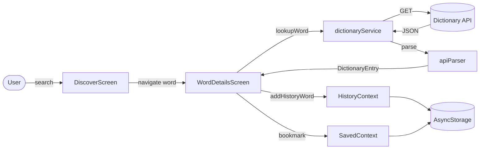

# Verba — Project Analysis

**Date:** June 8, 2026  
**Analyst scope:** Full repository audit — documentation, `package.json`, `App.tsx`, `src/`, and `stitch_verba_intelligence_platform/`  
**Client:** LexiTech Solutions Ltd, Kigali City

---

## 1. Executive Summary

**Verba** is a cross-platform dictionary mobile application built with **React Native (Expo 51)** and **TypeScript**. It consumes the public [Free Dictionary API](https://dictionaryapi.dev/) to deliver word lookup, rich definitions, pronunciation audio, search history, saved vocabulary collections, and a Neo-Minimalist glass-inspired UI aligned with the **Verba Intelligence Platform** design system.

The project exceeds the minimum academic brief (`Integrated Situation.md`) with extended features: onboarding, authentication (local demo), live search suggestions, vocabulary quiz, streak tracking, theme customization, and six distinct error states. Core assessment activities (search, display, audio, history, errors) are **functionally implemented**. Navigation was deliberately refactored from a drawer-first model to a **3-tab bottom navigation** pattern that better matches mobile design assets.

**Overall maturity:** Production-quality demo / academic submission ready for core dictionary flows; several design-only and platform-vision screens remain unimplemented.

---

## 2. Business Context

| Dimension | Detail |
|-----------|--------|
| **Product** | English dictionary mobile app |
| **Primary users** | Students and language learners seeking fast, polished word lookup |
| **Data source** | `https://api.dictionaryapi.dev/api/v2/entries/en/{word}` |
| **Persistence** | AsyncStorage (history, saved words, settings, auth session) |
| **Assessment timebox** | 5 hours (original brief); implementation has grown beyond minimum |
| **Design language** | Neo-Minimalism — Inter typography, Royal Indigo palette, glassmorphism |

### Stakeholder goals

1. Satisfy all five **Integrated Situation** activities for academic assessment.
2. Deliver a premium, design-faithful mobile experience matching Stitch HTML/PNG references.
3. Demonstrate React Native + Expo competency with Axios, navigation, audio, and local storage.

---

## 3. Technology Stack

| Layer | Technology | Version (approx.) |
|-------|------------|-------------------|
| Framework | Expo | ~51.0.0 |
| UI | React Native | 0.74.1 |
| Language | TypeScript | ~5.3.3 |
| Navigation | React Navigation (native-stack + bottom-tabs) | ^6.x |
| HTTP | Axios | ^1.7.2 |
| Audio | expo-av | ~14.0.7 |
| Glass UI | expo-blur | ~13.0.3 |
| Fonts | @expo-google-fonts/inter | ^0.4.2 |
| Storage | @react-native-async-storage/async-storage | 1.23.1 |
| Icons | @expo/vector-icons (MaterialIcons) | via Expo |

**Notable dependencies absent:** `@react-navigation/drawer` is listed in `package.json` but **no drawer navigator is wired** in `src/navigation/`. No NetInfo, no testing framework, no deep-linking package.

---

## 4. Application Architecture

### 4.1 Provider hierarchy (`App.tsx`)

```
ThemeProvider
└── AuthProvider
    └── AudioProvider
        └── HistoryProvider
            └── SavedProvider
                └── AppContent
                    ├── SafeAreaProvider
                    ├── StatusBar (theme-aware)
                    └── NavigationContainer → AppNavigator
```

### 4.2 Layered architecture

| Layer | Responsibility | Key locations |
|-------|----------------|---------------|
| **Presentation** | Screens, reusable components, custom tab bar | `src/screens/`, `src/components/` |
| **State** | Global React Context + AsyncStorage sync | `src/context/` |
| **Business logic** | API parsing, date grouping, settings helpers | `src/utils/`, `src/services/` |
| **Data** | Axios client, dictionary lookups | `src/services/api.ts`, `dictionaryService.ts` |
| **Models** | TypeScript interfaces | `src/models/DictionaryTypes.ts` |
| **Design tokens** | Colors, typography, spacing | `src/styles/theme.ts`, root `Design.md` |

### 4.3 Source inventory (`src/` — 47 files)

| Area | Files | Notes |
|------|-------|-------|
| `screens/` | 11 (+ 3 auth) | All primary user journeys |
| `components/` | 18 (+ 4 onboarding, 2 auth) | Rich component library |
| `context/` | 5 | Theme, Auth, Audio, History, Saved |
| `navigation/` | 2 | AppNavigator, navigationHelpers |
| `services/` | 2 | api.ts, dictionaryService.ts |
| `hooks/` | 2 | useDebounce (unused), useAudio (re-export) |
| `utils/` | 3 | apiParser, dateHelper, settingsHelper |
| `data/` | 1 | Static suggestion bank |
| `models/` | 1 | DictionaryTypes.ts |
| `styles/` | 1 | theme.ts |

**Planned but missing from `src/`:** `storage/localStore.ts`, `navigation/DrawerContent.tsx`, `assets/` (referenced in `app.json` but not listed in glob).

---

## 5. Navigation Architecture (Current)

The app uses a **Root Stack → Auth Stack / Main Tabs → Dictionary Stack** pattern:

```
RootStack
├── Onboarding          (first launch only)
├── Auth                  (Login → SignUp / ForgotPassword)
└── Main (Bottom Tabs)
    ├── Dictionary (Stack)
    │   ├── Discover      — home, search, WOTD, recent chips
    │   ├── WordDetails   — API results, audio, errors, notes
    │   └── Settings      — preferences (header account icon)
    ├── History           — full search history tab
    └── Saved             — saved words & quiz
```

**Bootstrap flow:**

1. `SplashScreen` shown while auth + first-launch flags resolve.
2. If `verba_first_launch_done !== 'true'` → **Onboarding**.
3. Else if not authenticated → **Auth (Login)**.
4. Else → **Main**.

**Design decision (documented in `docs/Navigation-Architecture-Report.md`):** Drawer navigation was removed. Activity 4 history requirements are met via the **History tab** and **Recent Lookups chips** on Discover.

---

## 6. Data Flow Summary



---

## 7. Feature Implementation Status

### 7.1 Core assessment activities

| Activity | Status | Implementation evidence |
|----------|--------|-------------------------|
| **1 — Search & API** | ✅ Complete | `DiscoverScreen`, `SearchBar`, `dictionaryService.ts`, `api.ts`, `apiParser.ts` |
| **2 — Word details** | ✅ Complete | `WordDetailsScreen` — word, phonetics, POS, definitions, examples, origin |
| **3 — Audio** | ✅ Complete | `AudioContext`, `PronunciationButton`, multi-accent chips, autoplay |
| **4 — History** | ⚠️ Functionally complete, pattern differs | `HistoryScreen`, `HistoryContext`, recent chips; **no drawer** |
| **5 — Error handling** | ✅ Complete | `ErrorView` with 6 types, retry, inline search on 404 |

### 7.2 Extended features

| Feature | Status | Notes |
|---------|--------|-------|
| Onboarding (4 slides) | ✅ Complete | Design-aligned slide components |
| Splash / bootstrap | ✅ Complete | Animated brand splash during init |
| Authentication | ✅ Partial | Login, SignUp, ForgotPassword; local AsyncStorage demo |
| Live suggestions | ✅ Complete | Static `suggestionBank.ts` prefix filter |
| Saved words & collections | ✅ Partial | Tabs work; save always defaults to Favorites |
| Vocabulary quiz | ✅ Complete | Modal MCQ from saved words, mastery increment |
| Streak tracking | ✅ Complete | `SavedContext.incrementStreak` on bookmark |
| Settings / theming | ✅ Complete | 3 themes, dark mode, font scale, autoplay toggle |
| Glass / design parity | ✅ Mostly complete | `GlassCard`, `VerbaTabBar`, Phase 2 polish done |
| Notifications toggle | ⚠️ UI only | Persisted preference; no push infrastructure |
| Voice search | ❌ Placeholder | Mic shows "not available" alert |
| Deep linking | ❌ Not implemented | Planned in `implementation_plan.md` only |
| Proactive offline (NetInfo) | ❌ Deferred | Relies on Axios error detection |
| Automated tests | ❌ None | Manual verification only |

---

## 8. Key Implementation Observations

### Strengths

- **Robust API layer:** Typed errors (`WORD_NOT_FOUND`, `NETWORK_OFFLINE`, `SERVER_TIMEOUT`, etc.) mapped to distinct UI states.
- **Audio architecture:** Centralized `AudioContext` with proper unload lifecycle; multi-accent selection on Word Details.
- **History persistence:** Deduplication, 100-item cap, date grouping, swipe-to-delete.
- **Auth gate:** Session expiry handling in `AuthContext`; demo account documented in README.
- **Design system fidelity:** Inter fonts, 8pt grid tokens, glass surfaces, custom tab bar.

### Gaps and technical debt

1. **`MeaningCard`, `DefinitionItem`, `ExampleText`** — built but **not used** by `WordDetailsScreen` (inline rendering instead).
2. **`useDebounce`** — exists but unused; suggestions filter synchronously.
3. **`@react-navigation/drawer`** — dependency installed, navigator removed.
4. **Word of the Day / Trending** — hardcoded mock content, not API-driven.
5. **Collection assignment** — no UI to choose Academic/Travel when saving from Word Details.
6. **PNG design assets** — README references `screen.png` files; repository contains **HTML only** in stitch folders (PNGs may be missing from clone).
7. **Several Stitch auth/state screens** have no React Native counterpart (OTP, session expired screen, update required).

---

## 9. Documentation Landscape

| Document | Purpose |
|----------|---------|
| `Integrated Situation.md` | **Authoritative assessment requirements** (5 activities) |
| `README.md` | User-facing project overview, setup, demo credentials |
| `design_documentation.md` | Comprehensive system design (DFD, architecture, models) |
| `implementation_plan.md` | Production blueprint with FR/NFR and screen mapping |
| `Design.md` / `stitch_.../DESIGN.md` | Design tokens (colors, typography, components) |
| `docs/Instruction-1-Application-Design.md` | First-hour design deliverable |
| `docs/Navigation-Architecture-Report.md` | Drawer → tabs migration rationale |
| `docs/Phase-2-Design-Parity.md` | Glass, onboarding, error state completion log |
| `docs/UI-Layout-Audit.md` | Layout clipping fixes post-GlassCard migration |
| `.cursor/project-mission.md` | Agent workflow rules (audit → verify) |

---

## 10. Project Health Assessment

| Criterion | Rating | Comment |
|-----------|--------|---------|
| Core dictionary functionality | **High** | Search → API → display → audio works end-to-end |
| Assessment compliance | **High** | All 5 activities covered; drawer wording is the only semantic deviation |
| Design parity | **Medium-High** | Core screens aligned; auth extras and platform screens missing |
| Code organization | **High** | Clear layering, typed models, context separation |
| Test coverage | **Low** | No unit, integration, or E2E tests |
| Production readiness | **Medium** | Demo auth, no real backend, no offline dictionary cache |

---

## 11. Recommended Next Steps (Analysis Only)

1. **Verify on device** — Run `npx expo start` and walk through Activities 1–5 with `hello`, invalid word, and airplane mode.
2. **Resolve drawer assessment wording** — Document in submission that History tab + recent chips satisfy Activity 4 intent.
3. **Close design gaps** — OTP/session-expired auth screens, collection picker on save, WOTD from API.
4. **Remove dead code** — Unused drawer dependency, wire `MeaningCard` or remove orphan components.
5. **Add tests** — At minimum, `apiParser` and `dictionaryService` error mapping unit tests.

---

*This analysis is read-only. No application source files were modified.*
