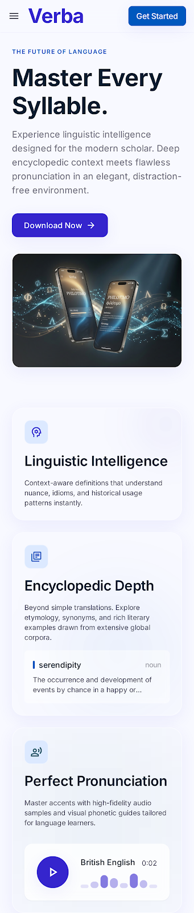

# Verba — Dictionary Mobile App

**Verba** is a cross-platform React Native dictionary built for [LexiTech Solutions Ltd](https://github.com/Ntarekp/Verba). It delivers fast word lookup, pronunciation audio, saved vocabulary collections, search history, and a glass-inspired UI aligned with the Verba Intelligence Platform design system.



## Features

- **Live search suggestions** — Autocomplete with part-of-speech badges as you type
- **Word details** — Definitions, examples, etymology, synonyms/antonyms, and learning notes
- **Audio pronunciation** — Play, pause, and switch accents when multiple recordings exist
- **Saved words** — Collections, mastery tracking, streak stats, and vocabulary quiz
- **Search history** — Recent lookups grouped by date
- **Authentication** — Sign in, sign up, password recovery, and session management
- **Offline-aware errors** — Clear states for not found, timeout, and connection issues
- **Theming** — Light/dark mode, font scaling, and appearance presets

## Screenshots

Design references and marketing assets live in [`stitch_verba_intelligence_platform/`](stitch_verba_intelligence_platform/):

| Screen | Preview |
|--------|---------|
| Dictionary & live suggestions | `search_live_suggestions/screen.png` |
| Word details (Ethereal) | `word_details_ethereal/screen.png` |
| Saved words collections | `saved_words_collections/screen.png` |
| Search history | `search_history/screen.png` |
| Settings | `settings_preferences/screen.png` |
| Authentication | `authentication_login/screen.png` |
| App Store showcase | `app_store_showcase/screen.png` |
| Splash & onboarding | `splash_screen/screen.png`, `onboarding_search/screen.png` |

## Tech Stack

- **React Native** (Expo 51)
- **TypeScript**
- **React Navigation** — Native stack + bottom tabs
- **Axios** — Free Dictionary API (`https://api.dictionaryapi.dev/api/v2/entries/en/{word}`)
- **AsyncStorage** — History, saved words, auth session, preferences
- **expo-av** — Audio playback
- **expo-blur** — Glass UI surfaces

## Getting Started

### Prerequisites

- Node.js 18+
- npm or yarn
- [Expo Go](https://expo.dev/go) on a device, or Android Studio / Xcode for emulators

### Install & run

```bash
git clone https://github.com/Ntarekp/Verba.git
cd Verba
npm install
npx expo start
```

Press `a` for Android, `i` for iOS, or scan the QR code with Expo Go.

### Demo account

| Field | Value |
|-------|-------|
| Email | `demo@verba.app` |
| Password | `Verba2024` |

You can also create a new account from the sign-up screen. Credentials are stored locally on the device for this demo build.

## Project Structure

```
src/
├── components/       # UI primitives (GlassCard, SearchBar, WordCard, …)
├── context/          # Theme, Auth, Audio, Saved, History
├── data/             # Suggestion bank for live search
├── navigation/       # App navigator and helpers
├── screens/          # Discover, WordDetails, Saved, History, Settings, Auth
├── services/         # Dictionary API (Axios)
└── styles/           # Theme tokens and typography
```

## Navigation

```
Root
├── Onboarding (first launch)
├── Auth (Login → SignUp / ForgotPassword)
└── Main (Bottom Tabs)
    ├── Dictionary → Discover, WordDetails, Settings
    ├── History
    └── Saved
```

## API

Word data is fetched from the [Free Dictionary API](https://dictionaryapi.dev/). The app handles 404 (word not found), network failures, and malformed responses with dedicated error screens.

## License

Educational project developed for LexiTech Solutions Ltd — Kigali City, Rwanda.

---

<p align="center">
  
  <br />
  <strong>Verba</strong> — Master your vocabulary with intelligent precision.
</p>
