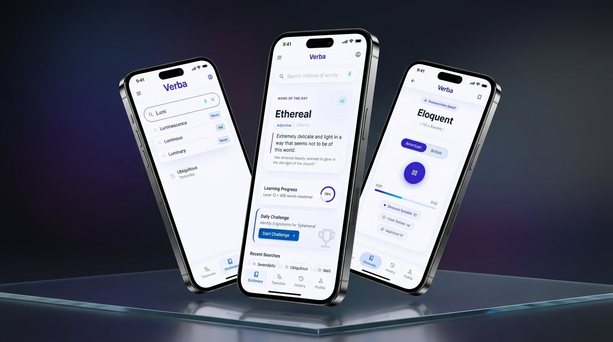

# Verba — Dictionary Mobile App

**Verba** is a cross-platform React Native dictionary app built for LexiTech Solutions Ltd. It combines fast search, audio pronunciation, saved words, and clean glass-style UI with a polished mobile experience.



## What this project includes

- A working React Native app in `src/`
- UI screens and business flow implemented for search, word details, saved collections, history, settings, and authentication
- Offline-aware error states and responsive theming
- Marketing and design assets located in `stitch_verba_intelligence_platform/stitch_verba_intelligence_platform/`

> The `stitch_verba_intelligence_platform/` directory contains marketing screens and design references for the Verba Intelligence Platform experience. These assets are for visual alignment and presentation, not runtime app code.

## Core features

- Live search suggestions with part-of-speech badges
- Word detail pages with definitions, examples, synonyms, antonyms, and pronunciation audio
- Saved vocabulary collections and mastery tracking
- Search history grouped by date
- Full authentication flow: login, signup, password recovery, and session persistence
- Clear state handling for offline, timeout, not found, and unexpected errors
- Light and dark themes plus font-scaling support

## Marketing & design assets

The following folders in `stitch_verba_intelligence_platform/stitch_verba_intelligence_platform/` contain marketing screens and showcase visuals used for presentation:

- `a_high_end_cinematic_3d_mockup_of_a_single_iphone_15_pro_floating_in_a_dark/`
- `a_premium_marketing_showcase_of_three_iphones_arranged_in_a_dynamic_overlapping/`
- `a_vertical_mobile_app_showcase_for_an_app_store_story._a_premium_smartphone/`
- `app_store_showcase/`
- `authentication_*`
- `onboarding_*`
- `search_*`
- `saved_words_collections/`
- `search_history/`
- `settings_preferences/`
- `splash_screen/`
- `word_details_ethereal/`
- `verba_app_logo/`

These directories are intended to support branding, storytelling, and app store-ready visuals.

## Quick start

### Prerequisites

- Node.js 18+
- npm or yarn
- [Expo CLI](https://expo.dev) installed globally or `npx expo`
- [Expo Go](https://expo.dev/go) for testing on a device, or Android/iOS emulator

### Install and run

```bash
git clone https://github.com/Ntarekp/Verba.git
cd Verba
npm install
npx expo start
```

Then choose `a` for Android, `i` for iOS, or scan the QR code with Expo Go.

## Demo credentials

If a demo login is available in this build, try:

| Field | Value |
|-------|-------|
| Email | `demo@verba.app` |
| Password | `Verba2024` |

If not, use the sign-up screen to create a local account.

## Project structure

```
src/
├── assets/           # Static files used by app screens
├── components/       # Reusable UI components
├── context/          # State providers for theme, auth, audio, saved words, history
├── data/             # Suggestion data and lookup helpers
├── navigation/       # Navigation stacks and tab setup
├── screens/          # App screens and feature pages
├── services/         # API and data services
└── styles/           # Theme tokens, spacing, typography, colors
```

## App flow

```
Root
├── Onboarding (first launch)
├── Auth (Login → SignUp / ForgotPassword)
└── Main (Bottom Tabs)
    ├── Dictionary → Discover, WordDetails, Settings
    ├── History
    └── Saved
```

## API

Word data is fetched from the [Free Dictionary API](https://dictionaryapi.dev/). The app is built to handle network errors, 404 results, and display clear error screens during failed lookups.

## Notes

- Keep `stitch_verba_intelligence_platform/` for marketing and design reference only.
- The app logic lives in `src/`.
- `.expo/` is generated by Expo and should not be committed as a source artifact.

## License

Educational project developed for LexiTech Solutions Ltd — Kigali City, Rwanda.
