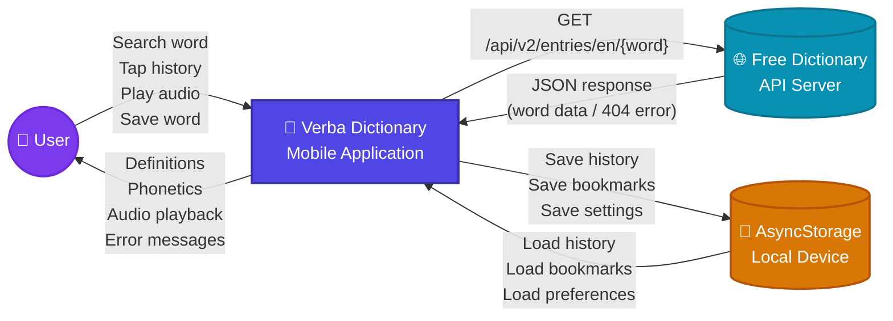
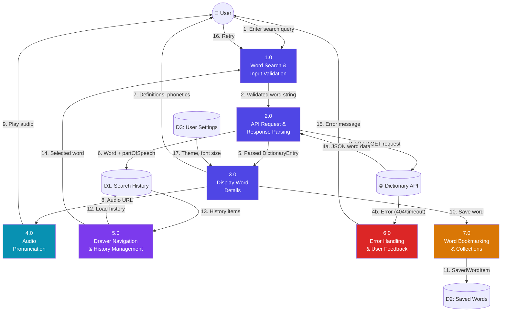
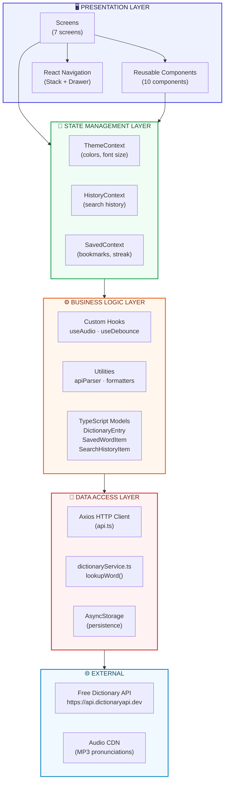
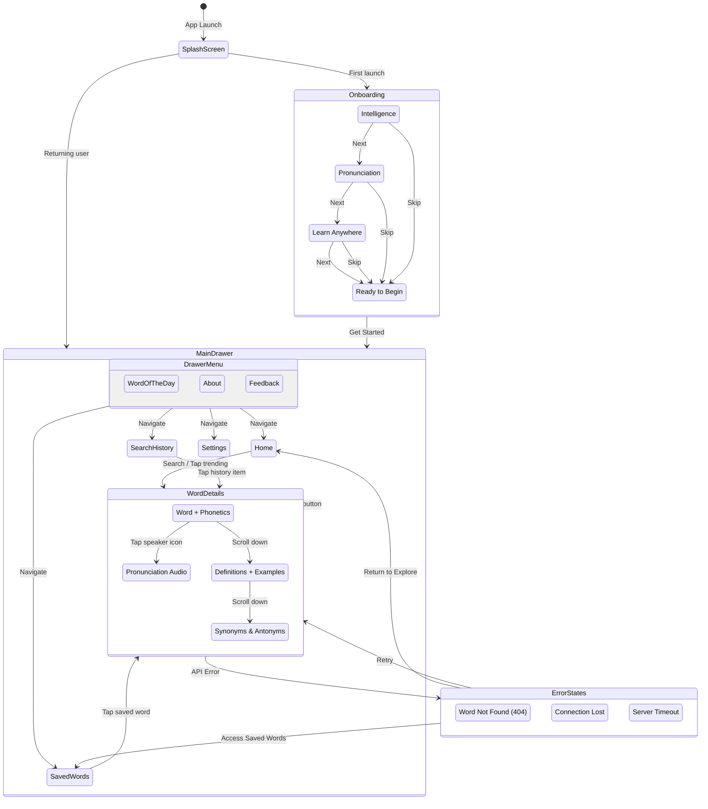
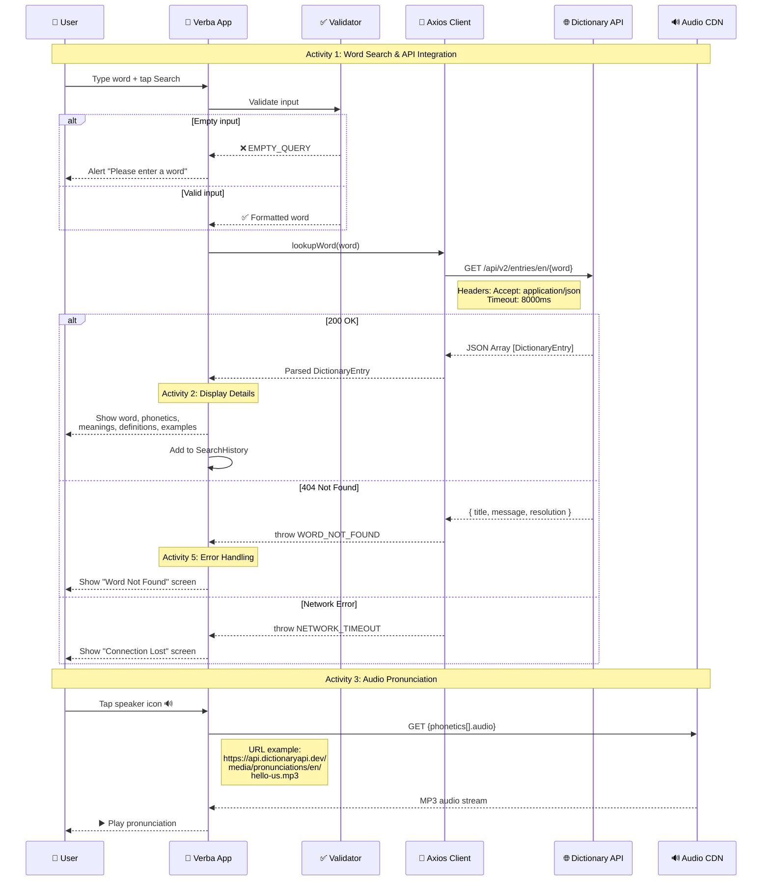
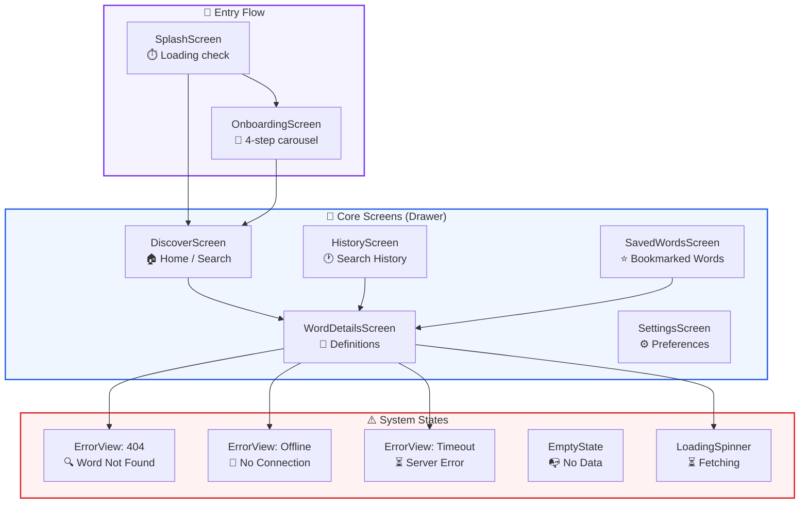
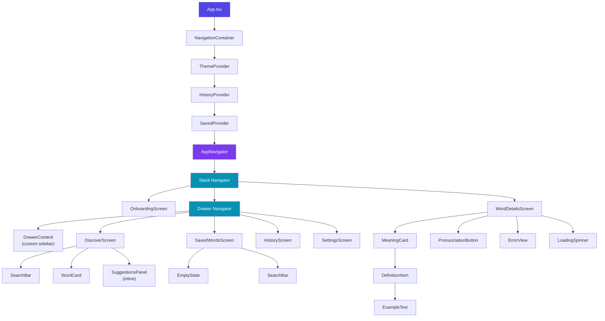
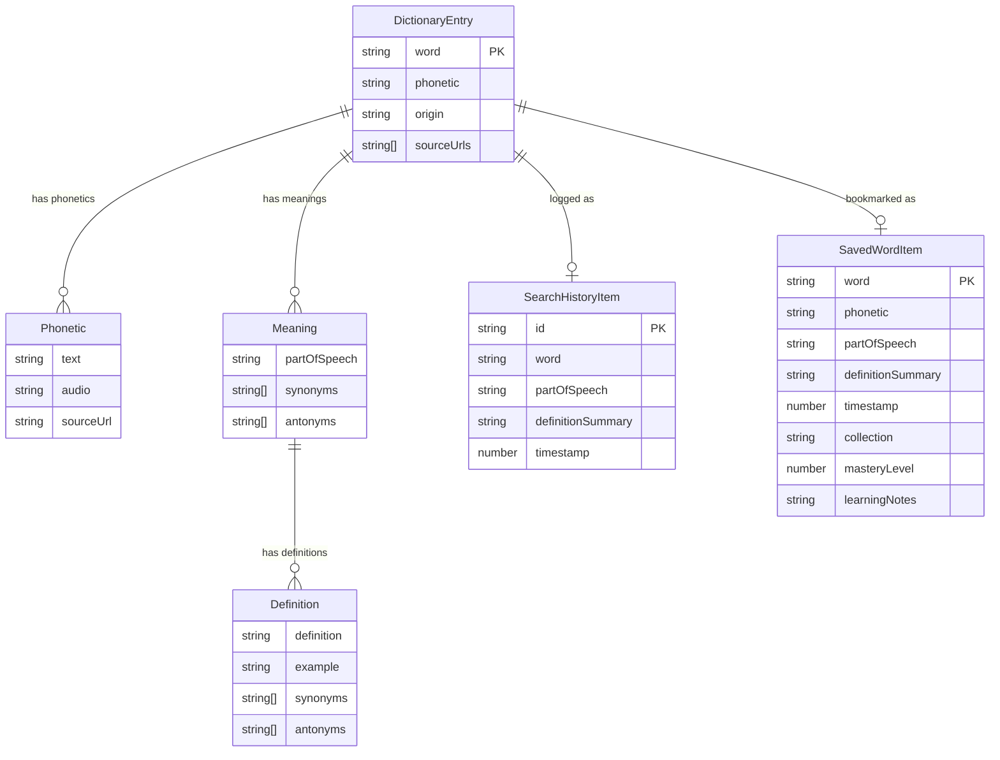
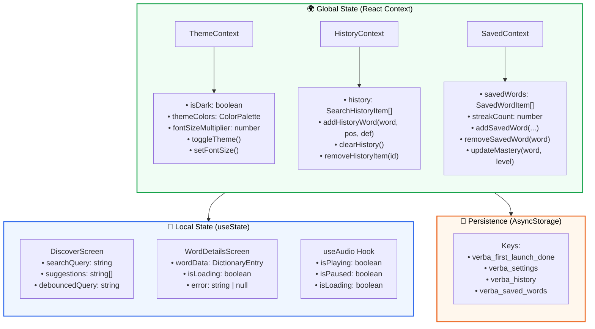
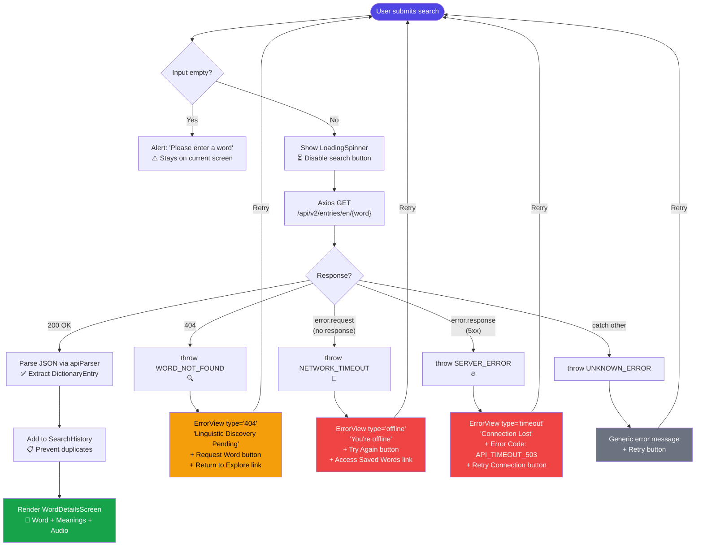

# Verba Dictionary Mobile Application — System Design Documentation

> **Client:** LexiTech Solutions Ltd, Kigali City
> **Project:** Cross-Platform Dictionary Mobile Application
> **API:** Free Dictionary API — `https://api.dictionaryapi.dev/api/v2/entries/en/`
> **Tech Stack:** React Native + Expo · TypeScript · Axios · React Navigation

---

## Table of Contents

1. [Data Flow Diagram (DFD) — Level 0 (Context)](#1-data-flow-diagram--level-0-context)
2. [Data Flow Diagram (DFD) — Level 1 (Detailed)](#2-data-flow-diagram--level-1-detailed)
3. [Application Architecture](#3-application-architecture)
4. [Navigation Flow](#4-navigation-flow)
5. [API Endpoints](#5-api-endpoints)
6. [Required Pages / Screens](#6-required-pages--screens)
7. [Component Hierarchy](#7-component-hierarchy)
8. [Data Models (Entity Relationship)](#8-data-models-entity-relationship)
9. [State Management Architecture](#9-state-management-architecture)
10. [Error Handling Flow](#10-error-handling-flow)

---

## 1. Data Flow Diagram — Level 0 (Context)

The Context DFD shows the **system boundary** of the Verba application and its interaction with external entities.



### Entities Explained

| Entity | Type | Description |
|---|---|---|
| **User** | External | End-user on Android/iOS device |
| **Verba Application** | Process | The React Native mobile app (system boundary) |
| **Free Dictionary API** | External | REST API providing word data at `dictionaryapi.dev` |
| **AsyncStorage** | Data Store | On-device persistent storage for history, saved words, settings |

---

## 2. Data Flow Diagram — Level 1 (Detailed)

This decomposes the system into its internal processes, showing how data flows between each Activity defined in the Integrated Situation.



### Process Descriptions

| Process | Activity | Description |
|---|---|---|
| **1.0** | Activity 1 | Validates input (non-empty check), formats word (trim, lowercase) |
| **2.0** | Activity 1 | Sends Axios GET to API, parses JSON via `apiParser.ts`, handles HTTP errors |
| **3.0** | Activity 2 | Extracts word, phonetics, meanings, definitions, examples for display |
| **4.0** | Activity 3 | Loads audio URL via `expo-av`, manages play/pause/stop states |
| **5.0** | Activity 4 | Drawer menu renders history, allows re-search by tapping items |
| **6.0** | Activity 5 | Detects 404, timeout, network errors; shows appropriate error screens |
| **7.0** | Extended | Saves words to collections (Favorites/Academic/Travel), tracks mastery |

---

## 3. Application Architecture

The layered architecture showing the separation of concerns from UI to data.



### Layer Responsibilities

| Layer | Responsibility | Key Files |
|---|---|---|
| **Presentation** | UI rendering, user interaction, screen layout | `*Screen.tsx`, `*Component.tsx`, `AppNavigator.tsx` |
| **State** | Global app state via React Context + `useReducer` | `ThemeContext`, `HistoryContext`, `SavedContext` |
| **Business** | Domain logic, hooks, data transformation | `useAudio.ts`, `useDebounce.ts`, `apiParser.ts` |
| **Data** | HTTP communication, local persistence | `api.ts`, `dictionaryService.ts`, `AsyncStorage` |
| **External** | Third-party services | Dictionary API, Audio CDN |

---

## 4. Navigation Flow

Shows every possible user navigation path through the application.



---

## 5. API Endpoints

### Base URL

```
https://api.dictionaryapi.dev/api/v2/entries/en/
```

### Endpoint Specification



### API Request & Response Reference

#### Request

| Field | Value |
|---|---|
| **Method** | `GET` |
| **URL** | `https://api.dictionaryapi.dev/api/v2/entries/en/{word}` |
| **Headers** | `Accept: application/json`, `Content-Type: application/json` |
| **Timeout** | 8000ms |
| **Library** | Axios (as required by Integrated Situation) |

#### Success Response (200 OK)

```json
[
  {
    "word": "hello",
    "phonetic": "/həˈloʊ/",
    "phonetics": [
      {
        "text": "/həˈloʊ/",
        "audio": "https://api.dictionaryapi.dev/media/pronunciations/en/hello-us.mp3",
        "sourceUrl": "https://commons.wikimedia.org/..."
      }
    ],
    "meanings": [
      {
        "partOfSpeech": "noun",
        "definitions": [
          {
            "definition": "\"Hello!\" or an equivalent greeting.",
            "synonyms": ["greeting"],
            "antonyms": [],
            "example": "She began the conversation with a hello."
          }
        ],
        "synonyms": ["greeting"],
        "antonyms": []
      }
    ],
    "sourceUrls": ["https://en.wiktionary.org/wiki/hello"]
  }
]
```

#### Error Response (404 Not Found)

```json
{
  "title": "No Definitions Found",
  "message": "Sorry pal, we couldn't find definitions for the word you were looking for.",
  "resolution": "You can try the search again at a later time or head to the web instead."
}
```

#### Error Code Mapping

| HTTP Status | Axios Error | App Error Code | User-Facing Message |
|---|---|---|---|
| 200 | — | — | Display results |
| 404 | `error.response.status === 404` | `WORD_NOT_FOUND` | "Linguistic Discovery Pending" |
| 5xx | `error.response` (non-404) | `SERVER_ERROR` | "Connection Lost" |
| No response | `error.request` (timeout) | `NETWORK_TIMEOUT` | "You're offline" |
| Parse fail | `catch` | `UNKNOWN_ERROR` | "Something went wrong" |
| Empty input | Validation | `EMPTY_QUERY` | Alert: "Please enter a word" |

---

## 6. Required Pages / Screens

### Screen Inventory



### Screen Details Table

| # | Screen | Route | Purpose | Activity | Key Components |
|---|---|---|---|---|---|
| 1 | **SplashScreen** | — (initial) | Brand loading + first-launch check via AsyncStorage | — | Logo, progress indicator |
| 2 | **OnboardingScreen** | `Onboarding` | 4-step horizontal carousel introducing app features | — | Carousel, dot indicators, Skip/Next/Get Started buttons |
| 3 | **DiscoverScreen** | `Discover` | Home screen with search bar, WotD card, trending words, bento grid stats | Act 1, 4 | SearchBar, WordCard, suggestions panel |
| 4 | **WordDetailsScreen** | `WordDetails` | Full word display: phonetics, meanings, definitions, examples, audio, synonyms/antonyms | Act 2, 3 | MeaningCard, DefinitionItem, ExampleText, PronunciationButton |
| 5 | **HistoryScreen** | `History` | Chronological list of all previously searched words | Act 4 | HistoryItem, search/filter, clear all |
| 6 | **SavedWordsScreen** | `SavedWords` | Bookmarked words organized by collection, quiz feature | Extended | WordCard (mini), collection tabs, quiz modal |
| 7 | **SettingsScreen** | `Settings` | Theme toggle, font size, notifications, autoplay, data management | Extended | Toggle switches, sliders, action buttons |

### Screen-to-Activity Mapping

| Activity | Primary Screen | Supporting Screens |
|---|---|---|
| **Activity 1:** Word Search & API Integration | DiscoverScreen | WordDetailsScreen |
| **Activity 2:** Display Word Details | WordDetailsScreen | — |
| **Activity 3:** Audio Pronunciation | WordDetailsScreen | DiscoverScreen (WotD audio) |
| **Activity 4:** Drawer Navigation & History | DrawerContent, HistoryScreen | DiscoverScreen (recent chips) |
| **Activity 5:** Error Handling & Feedback | ErrorView component | WordDetailsScreen, DiscoverScreen |

---

## 7. Component Hierarchy



---

## 8. Data Models (Entity Relationship)



### Type Definitions (TypeScript)

```typescript
// From src/models/DictionaryTypes.ts

interface Phonetic {
  text: string;
  audio: string;
  sourceUrl?: string;
}

interface Definition {
  definition: string;
  synonyms: string[];
  antonyms: string[];
  example?: string;
}

interface Meaning {
  partOfSpeech: string;
  definitions: Definition[];
  synonyms: string[];
  antonyms: string[];
}

interface DictionaryEntry {
  word: string;
  phonetic: string;
  phonetics: Phonetic[];
  meanings: Meaning[];
  origin?: string;
  sourceUrls: string[];
}

interface SearchHistoryItem {
  id: string;            // UUID
  word: string;
  partOfSpeech: string;
  definitionSummary: string;
  timestamp: number;     // Date.now()
}

interface SavedWordItem {
  word: string;
  phonetic: string;
  partOfSpeech: string;
  definitionSummary: string;
  timestamp: number;
  collection: 'Favorites' | 'Academic' | 'Travel';
  masteryLevel: 1 | 2 | 3;
  learningNotes?: string;
}
```

---

## 9. State Management Architecture



---

## 10. Error Handling Flow



---

## Directory Structure

```
D:\Mobile\Verba-Mobile\
├── App.tsx                          # Root component with providers
├── package.json                     # Dependencies (expo, axios, react-navigation)
├── babel.config.js                  # Babel with reanimated plugin
├── app.json                         # Expo configuration
├── Integrated Situation.md          # Requirements document
│
└── src/
    ├── assets/                      # Static assets (fonts, images)
    │
    ├── components/                  # Reusable UI components
    │   ├── SearchBar.tsx            # Text input with clear/submit
    │   ├── WordCard.tsx             # WotD hero card (word, phonetic, audio, definition)
    │   ├── MeaningCard.tsx          # Part-of-speech card with definitions
    │   ├── DefinitionItem.tsx       # Single definition with left-bar indicator
    │   ├── ExampleText.tsx          # Italic example sentence
    │   ├── PronunciationButton.tsx  # Audio play/pause button (expo-av)
    │   ├── ErrorView.tsx            # Error states (404, offline, timeout)
    │   ├── EmptyState.tsx           # Empty collection / no results
    │   ├── LoadingSpinner.tsx       # Animated loading indicator
    │   └── HistoryItem.tsx          # History list row (swipeable)
    │
    ├── screens/                     # Full-page screen components
    │   ├── SplashScreen.tsx         # Brand intro + first-launch check
    │   ├── OnboardingScreen.tsx     # 4-step feature carousel
    │   ├── DiscoverScreen.tsx       # Home: search, WotD, trending, stats
    │   ├── WordDetailsScreen.tsx    # Full word detail view
    │   ├── HistoryScreen.tsx        # Search history list
    │   ├── SavedWordsScreen.tsx     # Bookmarked words + quiz
    │   └── SettingsScreen.tsx       # App preferences
    │
    ├── navigation/                  # Navigation configuration
    │   ├── AppNavigator.tsx         # Stack + Drawer navigator setup
    │   └── DrawerContent.tsx        # Custom drawer sidebar
    │
    ├── context/                     # React Context providers
    │   ├── ThemeContext.tsx          # Dark/light mode + font scaling
    │   ├── HistoryContext.tsx        # Search history state
    │   └── SavedContext.tsx          # Saved words + streak state
    │
    ├── hooks/                       # Custom React hooks
    │   ├── useAudio.ts              # Audio playback via expo-av
    │   └── useDebounce.ts           # Input debouncing (200ms)
    │
    ├── services/                    # Data access layer
    │   ├── api.ts                   # Axios instance (baseURL, timeout, headers)
    │   └── dictionaryService.ts     # lookupWord() with error classification
    │
    ├── models/                      # TypeScript type definitions
    │   └── DictionaryTypes.ts       # All interfaces
    │
    ├── utils/                       # Utility functions
    │   └── apiParser.ts             # Raw API JSON → DictionaryEntry
    │
    └── styles/                      # Design system
        └── theme.ts                 # Colors, spacing, typography tokens
```

---

## Rendering These Diagrams

All diagrams above are written in **Mermaid** syntax. To render them:

### Option 1: Mermaid Live Editor (Recommended)
1. Visit [mermaid.live](https://mermaid.live)
2. Paste any code block between ` ```mermaid ` and ` ``` `
3. The diagram renders instantly in the browser
4. Export as **SVG** or **PNG**

### Option 2: VS Code Extension
1. Install **"Markdown Preview Mermaid Support"** extension
2. Open this `.md` file in VS Code
3. Press `Ctrl+Shift+V` to preview

### Option 3: GitHub / GitLab
- Push this file to any GitHub repository — GitHub natively renders Mermaid in `.md` files

### Option 4: Command Line (CLI)
```bash
npm install -g @mermaid-js/mermaid-cli
mmdc -i design_documentation.md -o output.pdf
```

---

> **Document Version:** 1.0
> **Author:** LexiTech Solutions Ltd — Mobile Development Team
> **Date:** June 8, 2026
> **Referenced:** Integrated Situation.md (Assessment Brief)
