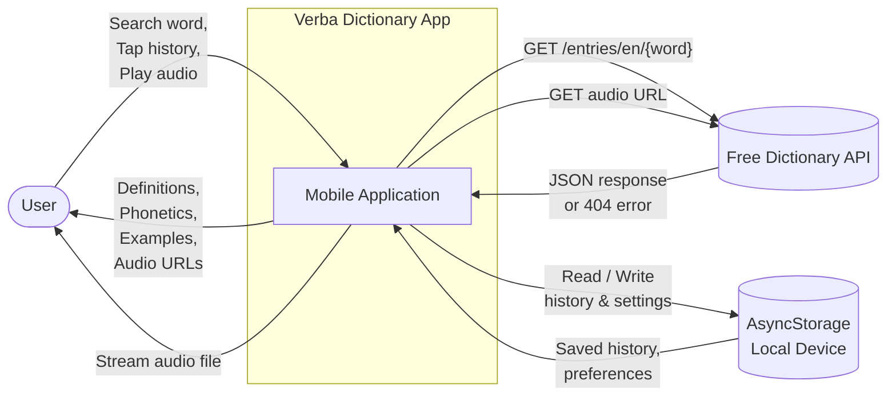
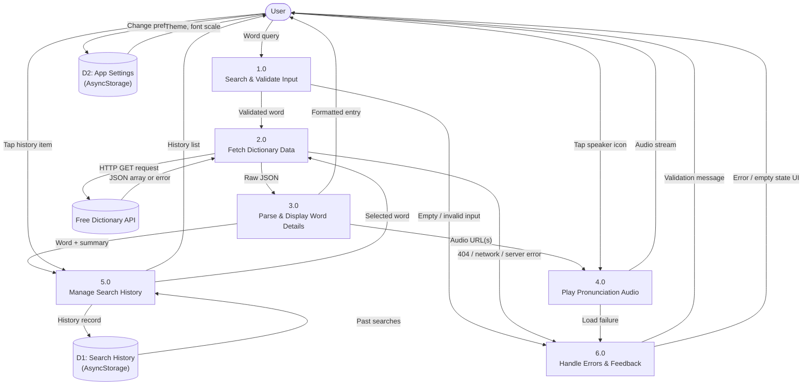
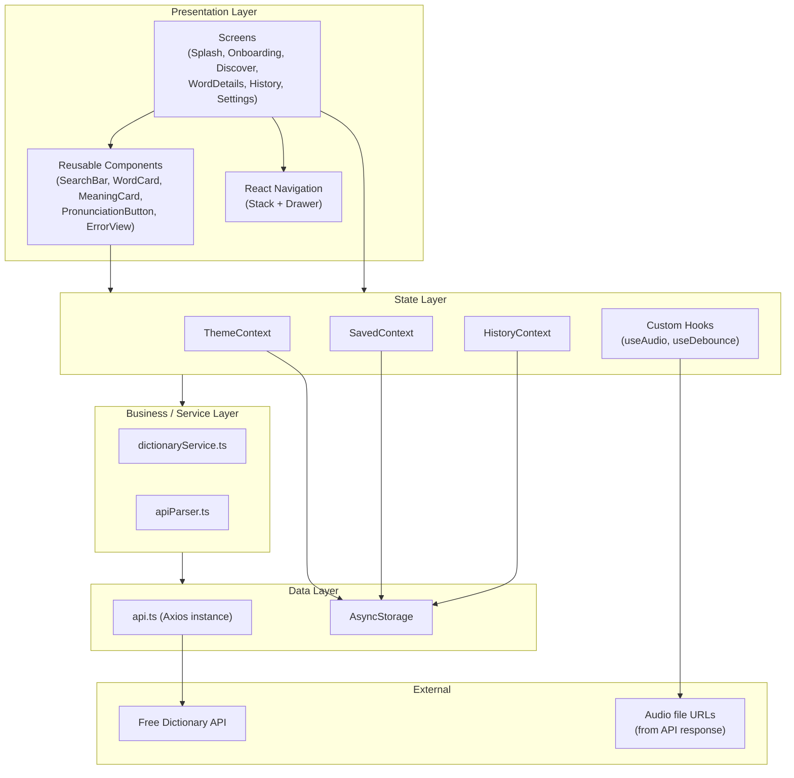
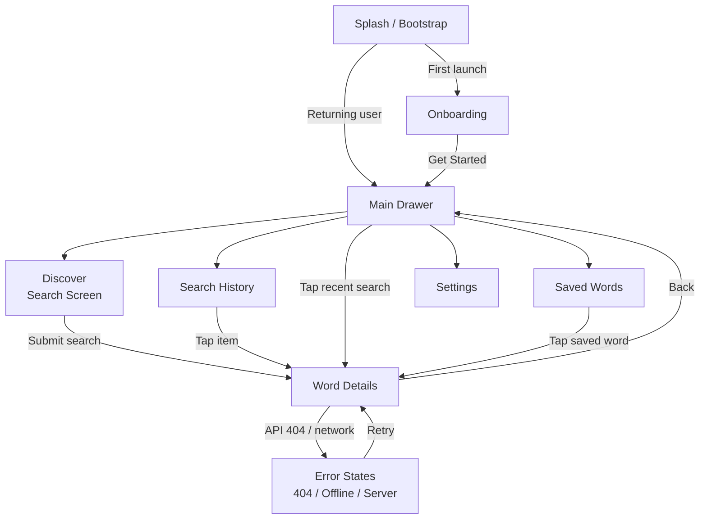

# Verba Dictionary Mobile App — Instruction 1 Design Document

**Project:** LexiTech Solutions Ltd — Dictionary Mobile Application  
**Platform:** React Native (Expo) — Android & iOS  
**Assessment reference:** `Integrated Situation.md` — Instructions (first hour)  
**Date:** June 2026

---

## 1. Problem Summary

The application helps users search English words, view definitions and examples, listen to pronunciations, and revisit past searches. All dictionary data is fetched from the public **Free Dictionary API**. The app must validate input, handle errors gracefully, and provide smooth navigation between screens.

---

## 2. Data Flow Diagram (DFD)

A Data Flow Diagram shows how data moves between the user, the mobile app, external services, and local storage.

### 2.1 Context Diagram (Level 0)

Shows the system as one process and its external entities.



**External entities**

| Entity | Role |
|--------|------|
| **User** | Enters search terms, views results, plays audio, opens drawer history |
| **Free Dictionary API** | Returns word entries (JSON) and hosts pronunciation audio files |
| **AsyncStorage** | Persists search history and app preferences on the device |

---

### 2.2 Level 1 DFD — Main Processes

Breaks the app into logical processes and data stores.



**Process descriptions**

| Process | Input | Output | Activity |
|---------|-------|--------|----------|
| **1.0 Search & Validate** | User text input | Trimmed word or validation error | Activity 1 |
| **2.0 Fetch Dictionary Data** | Validated word | HTTP response or error code | Activity 1 |
| **3.0 Parse & Display** | Raw JSON | Word, phonetics, meanings, definitions, examples | Activity 2 |
| **4.0 Play Audio** | Audio URL from API | Sound playback (play / pause / stop) | Activity 3 |
| **5.0 Manage History** | Successful lookup | Updated history list; re-search on tap | Activity 4 |
| **6.0 Handle Errors** | API / network / validation failures | User-friendly messages, retry option | Activity 5 |

**Data stores**

| Store | Key | Contents |
|-------|-----|----------|
| **D1 Search History** | `verba_history` | Array of `{ id, word, partOfSpeech, definitionSummary, timestamp }` |
| **D2 App Settings** | `verba_settings`, `verba_first_launch_done` | Onboarding flag, theme, font scale, autoplay |

---

### 2.3 Search-to-Result Sequence (detailed flow)

```mermaid
sequenceDiagram
    actor User
    participant Search as Search Screen
    participant Service as dictionaryService
    participant Axios as Axios Client
    participant API as Free Dictionary API
    participant Parser as apiParser
    participant Details as Word Details Screen
    participant History as HistoryContext
    participant Audio as useAudio Hook

    User->>Search: Enter word + submit
    Search->>Search: Validate (not empty)
    alt Empty input
        Search->>User: Show validation alert
    else Valid input
        Search->>Details: Navigate with { word }
        Details->>Details: Show loading indicator
        Details->>Service: lookupWord(word)
        Service->>Axios: GET /{word}
        Axios->>API: HTTP GET
        alt Success 200
            API-->>Axios: JSON array
            Axios-->>Service: response.data
            Service->>Parser: parseApiResponse(data)
            Parser-->>Service: DictionaryEntry
            Service-->>Details: typed entry
            Details->>History: addHistoryWord(word, pos, summary)
            History->>History: Save to AsyncStorage (no duplicates)
            Details->>User: Render definitions & examples
            opt Audio available
                User->>Details: Tap pronunciation icon
                Details->>Audio: playAudio(url)
                Audio->>User: Play / pause audio
            end
        else 404 Not Found
            API-->>Axios: 404
            Details->>User: "Word not found" + retry
        else Network / timeout
            API-->>Axios: No response
            Details->>User: Connection error + retry
        end
    end
```

---

## 3. Application Architecture

### 3.1 Layered Architecture

The app follows a **layered architecture** suitable for React Native: UI → State → Services → External API / Storage.



### 3.2 Architecture principles

| Principle | Implementation |
|-----------|----------------|
| **Separation of concerns** | Screens handle UI; `dictionaryService` handles API; `apiParser` handles JSON mapping |
| **Single API client** | One Axios instance in `api.ts` with base URL and timeout |
| **Typed models** | `DictionaryTypes.ts` defines `DictionaryEntry`, `Meaning`, `Phonetic`, etc. |
| **Global state via Context** | History and settings persisted through React Context + AsyncStorage |
| **Navigation** | Stack for onboarding + word details; Drawer for main app sections |
| **Error boundary pattern** | Service throws typed errors; screens map errors to `ErrorView` |

### 3.3 Technology stack

| Layer | Technology |
|-------|------------|
| Framework | React Native 0.74 + Expo 51 |
| Language | TypeScript |
| Navigation | `@react-navigation/native-stack`, `@react-navigation/drawer` |
| HTTP | Axios |
| Audio | `expo-av` |
| Local storage | `@react-native-async-storage/async-storage` |
| Testing (required) | Expo CLI (`expo start`, device/simulator testing) |

### 3.4 Folder structure (target)

```
Verba-Mobile/
├── App.tsx                      # Root providers + NavigationContainer
├── app.json                     # Expo config
├── src/
│   ├── screens/                 # One file per screen
│   ├── components/              # Reusable UI
│   ├── navigation/              # AppNavigator, DrawerContent
│   ├── context/                 # History, Saved, Theme
│   ├── hooks/                   # useAudio, useDebounce
│   ├── services/                # api.ts, dictionaryService.ts
│   ├── models/                  # DictionaryTypes.ts
│   ├── utils/                   # apiParser.ts, dateHelper.ts
│   └── styles/                  # theme.ts
└── docs/                        # Design documents (this file)
```

---

## 4. API Endpoints

### 4.1 External API (Free Dictionary API)

**Base URL**

```
https://api.dictionaryapi.dev/api/v2/entries/en
```

| # | Method | Endpoint | Purpose | Used in activity |
|---|--------|----------|---------|------------------|
| **API-1** | `GET` | `/api/v2/entries/en/{word}` | Look up a single English word | Activity 1, 2, 4 |
| **API-2** | `GET` | `{audioUrl}` (from response) | Stream pronunciation MP3 | Activity 3 |

**API-1 — Word lookup**

```
GET https://api.dictionaryapi.dev/api/v2/entries/en/{word}
```

| Item | Detail |
|------|--------|
| **Path parameter** | `word` — the search term (URL-encoded, lowercase) |
| **Success** | `200 OK` — JSON array of entry objects |
| **Not found** | `404` — word does not exist in dictionary |
| **Client handling** | Axios timeout (8s); map errors to user messages |

**Example request**

```
GET https://api.dictionaryapi.dev/api/v2/entries/en/hello
```

**Example success response (simplified)**

```json
[
  {
    "word": "hello",
    "phonetic": "/həˈləʊ/",
    "phonetics": [
      {
        "text": "/həˈləʊ/",
        "audio": "https://api.dictionaryapi.dev/media/pronunciations/en/hello-uk.mp3"
      }
    ],
    "meanings": [
      {
        "partOfSpeech": "noun",
        "definitions": [
          {
            "definition": "Used as a greeting or to begin a phone conversation.",
            "example": "hello there, Katie!"
          }
        ]
      }
    ]
  }
]
```

**Fields consumed by the app**

| JSON field | App usage |
|------------|-----------|
| `word` | Display title |
| `phonetic` / `phonetics[].text` | Phonetic spelling |
| `phonetics[].audio` | Pronunciation playback URL |
| `meanings[].partOfSpeech` | Part-of-speech label |
| `meanings[].definitions[].definition` | Definition text |
| `meanings[].definitions[].example` | Example sentence |
| `origin` | Etymology (optional, extended feature) |

**API-2 — Audio pronunciation**

Not a separate REST endpoint defined by us. The API returns absolute URLs in `phonetics[].audio`. The app loads these with `expo-av`:

```
GET {phonetics[n].audio}
```

---

### 4.2 Internal “endpoints” (service functions)

These are not HTTP endpoints; they are the app's service-layer API that screens call.

| Function | File | Input | Output | Error codes |
|----------|------|-------|--------|-------------|
| `lookupWord(word)` | `dictionaryService.ts` | `string` | `DictionaryEntry` | `EMPTY_QUERY`, `WORD_NOT_FOUND`, `NETWORK_TIMEOUT`, `SERVER_ERROR` |
| `parseApiResponse(data)` | `apiParser.ts` | `any[]` | `DictionaryEntry` | `EMPTY_RESPONSE` |
| `addHistoryWord(...)` | `HistoryContext.tsx` | word, pos, summary | void | — |
| `playAudio(url)` | `useAudio.ts` | audio URL | playback | Alert on failure |

---

### 4.3 Local storage keys (device persistence)

| Key | Data | Activity |
|-----|------|----------|
| `verba_history` | Search history array | Activity 4 |
| `verba_first_launch_done` | Onboarding completed flag | First launch |
| `verba_settings` | User preferences | Extended |
| `verba_saved_vocabulary` | Saved words | Extended |

---

## 5. Required Pages / Screens

Mapped directly to **Integrated Situation** activities and instructions.

### 5.1 Core screens (assessment minimum)

| # | Screen | Route name | Purpose | Activities | Key UI elements |
|---|--------|------------|---------|------------|-----------------|
| **S1** | **Search Screen** | `Discover` | Enter and submit a word search | Activity 1 | Text input, search button, validation message |
| **S2** | **Word Details Screen** | `WordDetails` | Show definitions, phonetics, examples | Activity 2, 3 | Word header, POS sections, definition list, speaker icon, loading state |
| **S3** | **Drawer Menu** | `DrawerContent` | App navigation + search history | Activity 4 | Menu items, recent searches list, tap-to-research |
| **S4** | **Error / Empty States** | (embedded in S2) | Word not found, network error, retry | Activity 5 | Error message, retry button, back link |
| **S5** | **Search History Screen** | `History` | Full history list (extends drawer) | Activity 4 | Grouped list, clear all, tap to re-search |

### 5.2 Supporting screens (first-hour design + current app)

| # | Screen | Route | Purpose |
|---|--------|-------|---------|
| **S6** | Splash | (gate before navigator) | Load fonts, check first launch |
| **S7** | Onboarding | `Onboarding` | First-time feature introduction |
| **S8** | Saved Words | `SavedWords` | Bookmarked vocabulary (extended) |
| **S9** | Settings | `Settings` | Theme, font size, preferences (extended) |

### 5.3 Screen navigation map



### 5.4 Screen-to-activity traceability

| Activity | Screens involved | User actions |
|----------|------------------|--------------|
| **Activity 1** — Search & API | S1 (Discover), S2 (WordDetails loading) | Type word → validate → submit → see spinner |
| **Activity 2** — Display details | S2 (WordDetails) | Scroll definitions, POS, examples |
| **Activity 3** — Audio | S2 (WordDetails) | Tap speaker → hear pronunciation |
| **Activity 4** — Drawer & history | S3 (Drawer), S5 (History), S2 | View history → tap word → new lookup |
| **Activity 5** — Errors | S4 (ErrorView on S2) | See message → retry or go back |

---

## 6. Component Responsibilities (per screen)

### S1 — Search Screen (`DiscoverScreen`)

- `SearchBar` — input, clear, submit
- Validate: reject empty string before navigation
- On success: `navigation.navigate('WordDetails', { word })`

### S2 — Word Details Screen (`WordDetailsScreen`)

- `lookupWord()` on mount
- `LoadingSpinner` while fetching
- `WordCard` — word, phonetic, save, audio trigger
- `MeaningCard` + `DefinitionItem` — definitions and examples
- `PronunciationButton` + `useAudio` — audio states
- `ErrorView` — 404, offline, server error + retry

### S3 — Drawer (`DrawerContent`)

- Links: Home, History, Saved, Settings
- Recent searches (last 5) with tap → `WordDetails`

### S5 — History (`HistoryScreen`)

- Full list from `HistoryContext`
- Group by date (Today, Yesterday, Older)
- Swipe to delete; Clear all

---

## 7. Error Handling Design

| Condition | Detection | User message | Action |
|-----------|-------------|--------------|--------|
| Empty search | Client validation | "Please enter a word to search." | Block navigation |
| Word not found | HTTP 404 | "Word not found" | Retry / go back |
| No network | Axios `error.request` | "Connection lost" | Retry |
| Server error | HTTP 5xx | "Server error" | Retry |
| Malformed JSON | `parseApiResponse` guard | Generic error | Retry; no crash |
| No audio URL | Missing `phonetics[].audio` | Hide/disable speaker icon | — |

---

## 8. Where to Implement (developer guide)

This design is already partially built in the repo. Use this map to continue:

| Design item | Implement in |
|-------------|--------------|
| DFD processes 1–2 (search + fetch) | `src/screens/DiscoverScreen.tsx`, `src/services/dictionaryService.ts` |
| DFD process 3 (display) | `src/screens/WordDetailsScreen.tsx`, `src/components/MeaningCard.tsx` |
| DFD process 4 (audio) | `src/hooks/useAudio.ts`, `src/components/PronunciationButton.tsx` |
| DFD process 5 (history) | `src/context/HistoryContext.tsx`, `src/navigation/DrawerContent.tsx` |
| DFD process 6 (errors) | `src/components/ErrorView.tsx` |
| API client | `src/services/api.ts` |
| Navigation | `src/navigation/AppNavigator.tsx` |
| Run & test | `npx expo start` then Android/iOS simulator or Expo Go |

**Suggested next steps after this document**

1. Verify each Activity 1–5 requirement against the running app.
2. Fix gaps identified in the audit (search button, 404 copy, param refresh on `WordDetails`).
3. Test on Expo CLI with real API calls (`hello`, invalid word `xyzabc123`, airplane mode).

---

## 9. Checklist — Instruction 1 complete

- [x] Data Flow Diagram (Context + Level 1 + Sequence)
- [x] Application Architecture (layers, stack, folder structure)
- [x] API Endpoints (external + internal services)
- [x] Required Pages/Screens (mapped to activities)
- [x] Implementation location guide

---

*This document satisfies Integrated Situation.md — Instructions, first-hour design requirements.*
